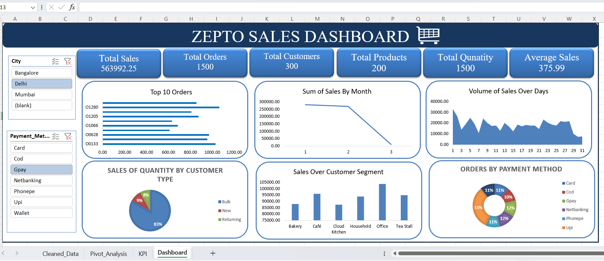

# Zepto Sales Dashboard — Excel Data Analytics Project

## Project Overview

This project presents an interactive **Zepto Sales Dashboard built using Microsoft Excel**. The objective of the project is to analyze sales data, identify important business trends, and present key insights through KPIs, Pivot Tables, and interactive visualizations.

The project follows an end-to-end data analysis workflow:

**Data → Data Cleaning → KPI Analysis → Pivot Tables → Charts → Dashboard**

---

## Project Objectives

* Analyze overall sales performance
* Track important sales KPIs
* Identify sales trends over time
* Analyze customer behavior and segments
* Understand payment-method distribution
* Identify top-performing orders
* Build a clear and interactive Excel dashboard for business decision-making

---

## Tools & Technologies

* **Microsoft Excel**
* Data Cleaning
* Excel Formulas
* Pivot Tables
* Pivot Charts
* KPI Analysis
* Data Visualization
* Dashboard Design

---

## Dataset

The dataset contains **1,500 sales records with 27 attributes** related to orders, customers, products, sales, delivery, and payment information.

### Key data fields include:

* Order ID
* Order Date
* Customer ID
* Customer Name
* Customer Type
* Customer Segment
* Product ID
* Product Name
* Category
* Quantity
* Unit Price
* Total Sales
* City
* Payment Method
* Delivery Status
* Delivery Time
* Discount
* Rating

---

## Data Analysis Process

### 1. Data Cleaning

The raw sales data was examined and prepared for analysis.

The cleaning process included:

* Identifying missing values
* Checking data types
* Reviewing duplicate records
* Validating numerical fields
* Checking categorical values
* Preparing the dataset for Pivot Table analysis

---

### 2. KPI Analysis

Key Performance Indicators were created to provide a quick overview of sales performance.

### Main KPIs

| KPI                           | Description                   |
| ----------------------------- | ----------------------------- |
| **Total Orders**              | Total number of orders        |
| **Total Sales**               | Overall sales generated       |
| **Total Customers**           | Number of customers           |
| **Total Products**            | Number of products            |
| **Total Quantity**            | Total quantity sold           |
| **Average Order Value (AOV)** | Average sales value per order |

---

## Pivot Table Analysis

Pivot Tables were created to analyze different aspects of the sales data.

The analysis includes:

* Monthly sales analysis
* Daily sales analysis
* Top 10 orders
* Customer type analysis
* Customer segment analysis
* Payment method analysis

These Pivot Tables were then used as the foundation for the dashboard visualizations.

---

## Dashboard

The final dashboard presents the major findings in a visually organized format.

### Dashboard Components

* **KPI Cards**
* **Top 10 Orders**
* **Monthly Sales Trend**
* **Daily Sales Trend**
* **Customer Type Analysis**
* **Customer Segment Analysis**
* **Payment Method Analysis**

### Dashboard Preview



---

## Key Business Insights

The dashboard can be used to identify:

* Overall sales performance
* Changes in sales over time
* High-value orders
* Customer purchasing patterns
* Differences between customer segments
* Preferred payment methods
* Sales distribution across different customer types

These insights can help businesses understand customer behavior and monitor sales performance.

---

## Project Structure

```text
Zepto-Sales-Dashboard/
│
├── README.md
│
├── Zepto_Sales_Dashboard.xlsx
│
└── Dashboard.png
```

### Files

**`Zepto_Sales_Dashboard.xlsx`**
Complete Excel project containing the dataset, KPI calculations, Pivot Tables, charts, and dashboard.

**`Dashboard.png`**
Preview image of the final dashboard.

---

## Skills Demonstrated

This project demonstrates practical skills in:

* Data Cleaning
* Data Analysis
* Excel Formulas
* KPI Development
* Pivot Tables
* Pivot Charts
* Data Visualization
* Dashboard Development
* Business Insights
* Analytical Thinking

---

## Future Improvements

Possible improvements to the project include:

* Adding Excel slicers for interactive filtering
* Adding more geographical analysis
* Creating product/category performance analysis
* Adding delivery-performance KPIs
* Adding profit and margin analysis
* Automating data refresh using Power Query
* Connecting the cleaned dataset to Power BI

---

## Author

**Dhanush C**

Aspiring **AI/ML & Data Analytics Professional**
